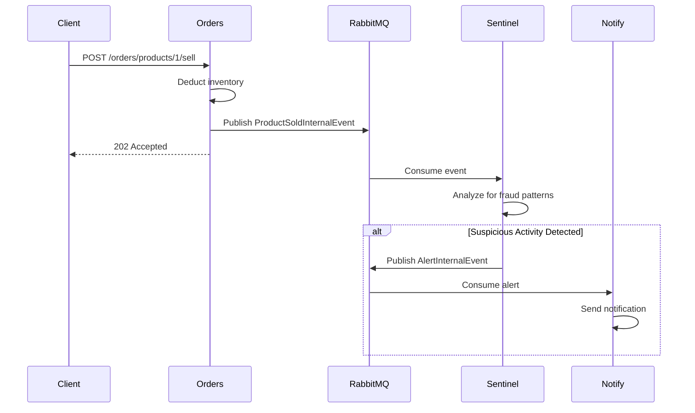

Argos Mesh uses an event-driven architecture with RabbitMQ for asynchronous communication between microservices. This page documents the internal events used across the system.

## Event Overview

The system publishes three main types of internal events:

- **ProductSoldInternalEvent** - Published when a product is sold
- **ProductCreatedInternalEvent** - Published when a new product is created
- **AlertInternalEvent** - Published when suspicious activity is detected

---

## ProductSoldInternalEvent

Published by the Orders service when a product sale transaction is completed. This event is consumed by the Sentinel service for fraud detection and monitoring.

### Event Schema

```java
package com.argos.orders.dto.event;

import java.time.LocalDateTime;

public record ProductSoldInternalEvent(
    Long productID,
    Integer quantity,
    String ipAddress,
    LocalDateTime timeStamp
)
```

### Fields

<ResponseField name="productID" type="Long" required>
  The unique identifier of the product that was sold
</ResponseField>

<ResponseField name="quantity" type="Integer" required>
  The number of units sold in the transaction
</ResponseField>

<ResponseField name="ipAddress" type="String" required>
  The client IP address from which the purchase was made. Used for fraud detection and geographic analysis.
</ResponseField>

<ResponseField name="timeStamp" type="LocalDateTime" required>
  The exact date and time when the sale occurred in ISO-8601 format
</ResponseField>

### Message Configuration

<ParamField body="Queue" type="String">
  `argos.sales.queue`
</ParamField>

<ParamField body="Exchange" type="String">
  `shop.exchange` (Topic Exchange)
</ParamField>

<ParamField body="Routing Key" type="String">
  `shop.event.sold`
</ParamField>

### Event Example

```json
{
  "productID": 1,
  "quantity": 5,
  "ipAddress": "192.168.1.100",
  "timeStamp": "2026-03-05T14:30:45.123"
}
```

### Event Flow



<Info>
  The Orders service uses the `shop.exchange` Topic Exchange to allow multiple consumers to process sale events independently.
</Info>

---

## ProductCreatedInternalEvent

Published by the Orders service when a new product is successfully created in the system.

### Event Schema

```java
package com.argos.orders.dto.event;

import com.argos.orders.dto.ProductResponse;

public record ProductCreatedInternalEvent(ProductResponse response)
```

### Fields

<ResponseField name="response" type="ProductResponse" required>
  The complete product information including the newly generated ID
  
  <Expandable title="ProductResponse Schema">
    ```java
    public record ProductResponse(
        Long productID,
        String productName,
        BigDecimal productPrice,
        Integer productStock
    )
    ```
  </Expandable>
</ResponseField>

### Message Configuration

<ParamField body="Queue" type="String">
  `argos.products.mgmt.queue`
</ParamField>

<ParamField body="Exchange" type="String">
  `shop.exchange` (Topic Exchange)
</ParamField>

<ParamField body="Routing Key" type="String">
  `shop.event.product.#` (wildcard pattern)
</ParamField>

### Event Example

```json
{
  "response": {
    "productID": 42,
    "productName": "Laptop",
    "productPrice": 999.99,
    "productStock": 50
  }
}
```

<Note>
  The routing key uses a wildcard pattern (`shop.event.product.#`) to allow for future product-related events such as `shop.event.product.updated` or `shop.event.product.deleted`.
</Note>

---

## AlertInternalEvent

Published by the Sentinel service when suspicious activity or security threats are detected, such as DDoS attacks or unusual purchasing patterns.

### Event Schema

```java
package com.argos.notify.dto;

import java.time.LocalDateTime;

public record AlertInternalEvent(
    String type,
    String sourceIp,
    String severity,
    LocalDateTime timeStamp
)
```

### Fields

<ResponseField name="type" type="String" required>
  The type of alert detected. Common values:
  - `DDoS Attack`
  - `Suspicious Purchase Pattern`
  - `Rate Limit Exceeded`
  - `Inventory Manipulation`
</ResponseField>

<ResponseField name="sourceIp" type="String" required>
  The IP address associated with the suspicious activity (e.g., `127.0.0.1`, `192.168.1.100`)
</ResponseField>

<ResponseField name="severity" type="String" required>
  The severity level of the alert:
  - `CRITICAL` - Immediate action required
  - `HIGH` - Requires urgent attention
  - `MEDIUM` - Should be investigated
  - `LOW` - Informational
</ResponseField>

<ResponseField name="timeStamp" type="LocalDateTime" required>
  When the alert was generated in ISO-8601 format
</ResponseField>

### Message Configuration

<ParamField body="Queue" type="String">
  `argos.alert.queue`
</ParamField>

<ParamField body="Exchange" type="String">
  `alert.exchange` (Topic Exchange)
</ParamField>

<ParamField body="Routing Key" type="String">
  `argos.alert.#` (wildcard pattern)
</ParamField>

### Event Example

```json
{
  "type": "DDoS Attack",
  "sourceIp": "203.0.113.42",
  "severity": "CRITICAL",
  "timeStamp": "2026-03-05T14:35:22.789"
}
```

### Consumers

The `AlertInternalEvent` is consumed by:

- **Notify Service** - Sends notifications to administrators via email, SMS, or other channels
- **Security Dashboard** - Updates real-time monitoring displays
- **Logging System** - Archives alerts for compliance and audit purposes

<Warning>
  CRITICAL severity alerts trigger immediate notifications and may automatically block the source IP address depending on system configuration.
</Warning>

---

## RabbitMQ Configuration

### Exchanges

The system uses two main Topic Exchanges:

| Exchange Name | Purpose |
|---------------|----------|
| `shop.exchange` | Product and sales events |
| `alert.exchange` | Security and monitoring alerts |

### Queues

| Queue Name | Bound To | Routing Key | Consumer |
|------------|----------|-------------|----------|
| `argos.sales.queue` | `shop.exchange` | `shop.event.sold` | Sentinel Service |
| `argos.products.mgmt.queue` | `shop.exchange` | `shop.event.product.#` | Product Management |
| `argos.alert.queue` | `alert.exchange` | `argos.alert.#` | Notify Service |

### Message Serialization

All events are serialized as JSON using Jackson with the following configuration:

```java
ObjectMapper mapper = new ObjectMapper();
mapper.registerModule(new JavaTimeModule());
mapper.disable(SerializationFeature.WRITE_DATES_AS_TIMESTAMPS);
```

<Info>
  The `JavaTimeModule` ensures that `LocalDateTime` fields are serialized as ISO-8601 strings rather than timestamps.
</Info>

---

## Event Publishing

### From Orders Service

The Orders service publishes events using Spring AMQP:

```java
// Publishing a ProductSoldInternalEvent
ProductSoldInternalEvent event = new ProductSoldInternalEvent(
    productId,
    quantity,
    clientIp,
    LocalDateTime.now()
);

rabbitTemplate.convertAndSend(
    "shop.exchange",
    "shop.event.sold",
    event
);
```

### From Sentinel Service

The Sentinel service publishes alerts:

```java
// Publishing an AlertInternalEvent
AlertInternalEvent alert = new AlertInternalEvent(
    "DDoS Attack",
    sourceIp,
    "CRITICAL",
    LocalDateTime.now()
);

rabbitTemplate.convertAndSend(
    "alert.exchange",
    "argos.alert.critical",
    alert
);
```

---

## Event Consumption

### Listening to Sales Events

```java
@RabbitListener(queues = "argos.sales.queue")
public void handleProductSold(ProductSoldInternalEvent event) {
    // Process the sale event
    log.info("Product {} sold: {} units from IP {}",
        event.productID(),
        event.quantity(),
        event.ipAddress());
    
    // Perform fraud analysis
    fraudDetectionService.analyze(event);
}
```

### Listening to Alert Events

```java
@RabbitListener(queues = "argos.alert.queue")
public void handleAlert(AlertInternalEvent alert) {
    // Send notification based on severity
    if ("CRITICAL".equals(alert.severity())) {
        notificationService.sendUrgentAlert(alert);
    } else {
        notificationService.logAlert(alert);
    }
}
```

---

## Best Practices

<AccordionGroup>
  <Accordion title="Event Idempotency">
    Consumers should be designed to handle duplicate events gracefully. Use unique transaction IDs or timestamps to detect and skip duplicate processing.
  </Accordion>

  <Accordion title="Error Handling">
    Implement dead letter queues (DLQs) for messages that fail processing. Configure retry policies with exponential backoff.
  </Accordion>

  <Accordion title="Monitoring">
    Monitor queue depths, message rates, and consumer lag to ensure healthy event processing. Set up alerts for queue buildup.
  </Accordion>

  <Accordion title="Schema Evolution">
    When modifying event schemas, maintain backward compatibility. Add new optional fields rather than modifying existing ones.
  </Accordion>
</AccordionGroup>

---

## Troubleshooting

### Messages Not Being Consumed

1. Verify the queue exists and is bound to the correct exchange
2. Check the routing key matches the binding pattern
3. Ensure the consumer service is running and connected to RabbitMQ
4. Review consumer logs for exceptions

### High Queue Depth

1. Check if consumers are processing messages slowly
2. Scale up the number of consumer instances
3. Investigate if messages are being rejected and requeued
4. Review message sizes and processing complexity

<Tip>
  Use the RabbitMQ Management UI at `http://localhost:15672` to monitor queues, exchanges, and message flows in real-time.
</Tip>