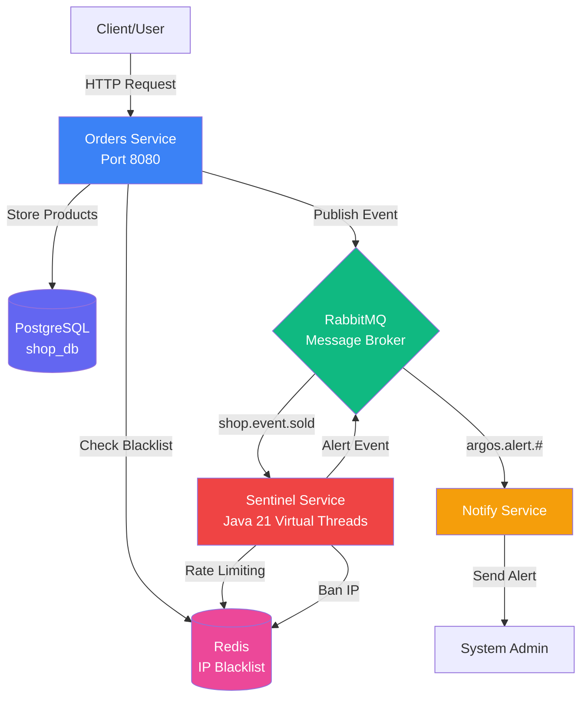
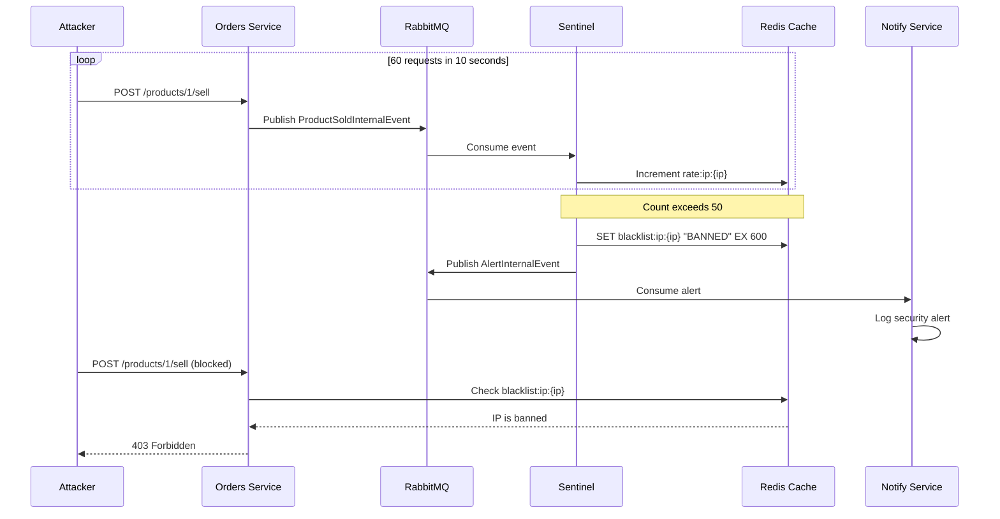

Argos Mesh is built on a modern microservices architecture designed to detect and prevent DDoS attacks in real-time. The system leverages event-driven patterns, distributed caching, and Java 21's Virtual Threads for high-performance traffic analysis.

## System Overview

Argos Mesh consists of three core microservices and three supporting infrastructure components:

<CardGroup cols={3}>
  <Card title="Orders Service" icon="cart-shopping" color="#3b82f6">
    E-commerce API with product management and sales endpoints
  </Card>
  <Card title="Sentinel Service" icon="shield-halved" color="#ef4444">
    Real-time traffic analyzer and DDoS detection engine
  </Card>
  <Card title="Notify Service" icon="bell" color="#f59e0b">
    Alert notification worker for security events
  </Card>
  <Card title="PostgreSQL" icon="database" color="#6366f1">
    Persistent storage for product catalog
  </Card>
  <Card title="RabbitMQ" icon="rabbit" color="#10b981">
    Message broker for event-driven communication
  </Card>
  <Card title="Redis" icon="cubes" color="#ec4899">
    In-memory cache for IP blacklist and rate limiting
  </Card>
</CardGroup>

## Architecture Diagram



## Data Flow

Understanding how data flows through Argos Mesh is crucial for grasping its DDoS prevention capabilities.

### Normal Traffic Flow

When a legitimate user makes a purchase, the system follows this flow:

<Steps>
  <Step title="Client Request">
    User sends a POST request to `/orders/products/{id}/sell` with the quantity to purchase.
    
    ```http
    POST /orders/products/1/sell HTTP/1.1
    Host: localhost:8080
    Content-Type: application/json
    
    {
      "quantity": 1
    }
    ```
  </Step>

  <Step title="IP Extraction">
    The Orders service extracts the client's IP address from the HTTP request:
    
    ```java ProductController.java
    @PostMapping("/{id}/sell")
    public ResponseEntity<Void> sellProduct(
            @PathVariable Long id,
            @RequestBody BuyRequest buyRequest,
            HttpServletRequest request) {
        String clientIp = request.getRemoteAddr();
        productService.sellProduct(id, clientIp, buyRequest.quantity());
        return ResponseEntity.accepted().build();
    }
    ```
  </Step>

  <Step title="Stock Update">
    The service updates the product stock in PostgreSQL and publishes a sale event to RabbitMQ with the client's IP address.
  </Step>

  <Step title="Event Consumption">
    The Sentinel service consumes the `ProductSoldInternalEvent` from the `argos.sales.queue`:
    
    ```java SalesListener.java
    @RabbitListener(queues = "argos.sales.queue")
    public void processSalesEvents(ProductSoldInternalEvent data) {
        String ip = data.ipAddress();
        
        if (redisService.isBanned(ip)) {
            return; // Ignore events from banned IPs
        }
        
        if (analyzer.processAndCheckLimit(ip)) {
            // Suspicious activity detected
            AlertInternalEvent event = new AlertInternalEvent(
                "Suspicious behavior", 
                ip, 
                "CRITICAL", 
                LocalDateTime.now()
            );
            rabbitTemplate.convertAndSend(
                RabbitMQConfig.ALERT_EXCHANGE,
                "argos.alert.security",
                event
            );
        } else {
            System.out.println("[ Sentinel🛡️ ] Normal traffic of the IP: " + ip);
        }
    }
    ```
  </Step>

  <Step title="Rate Limit Check">
    The TrafficAnalyzer checks if the IP has exceeded the rate limit (50 requests per 10 seconds):
    
    ```java TrafficAnalyzer.java
    public boolean processAndCheckLimit(String ip) {
        if (redisService.isBanned(ip)) return true;
        
        String key = "rate:ip:" + ip;
        Long currentCount = redisTemplate.opsForValue().increment(key);
        
        if (currentCount != null && currentCount == 1) {
            redisTemplate.expire(key, Duration.ofSeconds(10));
        }
        
        if (currentCount != null && currentCount > 50) {
            redisService.banIp(ip, 10); // Ban for 10 minutes
            return true;
        }
        
        return false;
    }
    ```
  </Step>
</Steps>

### Attack Detection Flow

When a DDoS attack is detected, the system responds immediately:



## Component Deep Dive

### Orders Service

The Orders service is the public-facing API that handles all product operations.

**Technology Stack:**
- Spring Boot 4.0.3
- Java 21
- Spring Data JPA
- PostgreSQL Driver
- Spring AMQP (RabbitMQ)
- Spring Data Redis
- MapStruct for DTO mapping

**Key Components:**

<CodeGroup>

```java ProductController.java
@RestController
@RequestMapping("/orders/products")
public class ProductController {
    private final IProductService productService;
    
    @PostMapping("/{id}/sell")
    public ResponseEntity<Void> sellProduct(
            @PathVariable Long id,
            @RequestBody BuyRequest buyRequest,
            HttpServletRequest request) {
        String clientIp = request.getRemoteAddr();
        productService.sellProduct(id, clientIp, buyRequest.quantity());
        return ResponseEntity.accepted().build();
    }
}
```

```java Product.java
@Entity
@Table(name = "products")
public class Product {
    @Id
    @GeneratedValue(strategy = GenerationType.IDENTITY)
    private Long productID;
    
    @NotNull
    @NotBlank
    private String productName;
    
    @NotNull
    @Positive
    private BigDecimal productPrice;
    
    @NotNull
    @PositiveOrZero
    private Integer productStock;
}
```

</CodeGroup>

**Environment Configuration:**

```properties application.properties
spring.application.name=argos-orders

# PostgreSQL
spring.datasource.url=jdbc:postgresql://db:5432/shop_db
spring.datasource.username=user_shop
spring.datasource.password=secretPassword
spring.jpa.database-platform=org.hibernate.dialect.PostgreSQLDialect
spring.jpa.hibernate.ddl-auto=update

# RabbitMQ
spring.rabbitmq.host=message_broker
spring.rabbitmq.port=5672
spring.rabbitmq.username=admin
spring.rabbitmq.password=admin123
spring.rabbitmq.listener.simple.prefetch=1
```

### Sentinel Service

The Sentinel is the heart of Argos Mesh's DDoS prevention system. It uses Java 21's Virtual Threads for efficient concurrent processing of high-traffic events.

**Technology Stack:**
- Spring Boot 4.0.3
- Java 21 with Virtual Threads enabled
- Spring Data Redis
- Spring AMQP (RabbitMQ)
- Jackson for JSON serialization

**Key Features:**
- Real-time rate limiting using Redis counters
- Sliding window algorithm (50 requests per 10 seconds)
- Automatic IP blacklisting for 10 minutes
- Event-driven alert publishing

**Rate Limiting Algorithm:**

The Sentinel uses a simple but effective sliding window counter stored in Redis:

1. **Increment counter:** Each sale event increments `rate:ip:{ip}` in Redis
2. **Set TTL:** First request sets a 10-second TTL on the key
3. **Check threshold:** If count exceeds 50, the IP is banned
4. **Ban duration:** Banned IPs are stored as `blacklist:ip:{ip}` with a 10-minute TTL

```java RedisService.java
@Service
public class RedisService {
    private final StringRedisTemplate redisTemplate;
    private static final String BLACKLIST_PREFIX = "blacklist:ip:";
    
    public void banIp(String ipAddress, long durationMinutes) {
        redisTemplate.opsForValue().set(
            BLACKLIST_PREFIX + ipAddress,
            "BANNED",
            Duration.ofMinutes(durationMinutes)
        );
    }
    
    public boolean isBanned(String ipAddress) {
        return Boolean.TRUE.equals(
            redisTemplate.hasKey(BLACKLIST_PREFIX + ipAddress)
        ); 
    }
}
```

**Virtual Threads Configuration:**

Virtual Threads are enabled via environment variable in docker-compose.yml:

```yaml docker-compose.yml
sentinel:
  environment:
    - SPRING_THREADS_VIRTUAL_ENABLED=true
```

This allows the Sentinel to handle thousands of concurrent event processing tasks with minimal overhead.

### Notify Service

The Notify service is a worker that consumes security alerts and sends notifications to system administrators.

**Technology Stack:**
- Spring Boot 4.0.3
- Java 21
- Spring AMQP (RabbitMQ)

**Alert Processing:**

```java AlertNotifier.java
@Service
public class AlertNotifier {
    
    @RabbitListener(queues = "argos.alert.queue")
    public void sendNotification(AlertInternalEvent alert) {
        System.out.println("[ Alert ] - " + alert.timeStamp());
        System.out.println("The IP: " + alert.sourceIp());
        System.out.println("Is suspicious of try an: " + alert.type());
        System.out.println("This is: " + alert.severity());
    }
}
```

<Note>
  In production, this service would integrate with email, SMS, or incident management systems like PagerDuty or Opsgenie.
</Note>

## Message Broker Configuration

RabbitMQ acts as the central nervous system of Argos Mesh, coordinating communication between microservices.

### Exchange and Queue Topology

```mermaid
graph LR
    O[Orders Service] -->|shop.event.sold| SE[shop.exchange]
    SE -->|shop.event.sold| SQ[argos.sales.queue]
    SQ --> S[Sentinel Service]
    
    S -->|argos.alert.security| AE[alert.exchange]
    AE -->|argos.alert.#| AQ[argos.alert.queue]
    AQ --> N[Notify Service]
    
    style SE fill:#10b981,color:#fff
    style AE fill:#10b981,color:#fff
    style SQ fill:#6366f1,color:#fff
    style AQ fill:#6366f1,color:#fff
```



### RabbitMQ Configuration

The Sentinel service defines all exchanges, queues, and bindings:

```java RabbitMQConfig.java
@Configuration
public class RabbitMQConfig {
    public static final String QUEUE_ALERT = "argos.alert.queue";
    public static final String ALERT_EXCHANGE = "alert.exchange";
    public static final String RK_ALERT = "argos.alert.#";
    
    public static final String QUEUE_SALE = "argos.sales.queue";    
    public static final String EXCHANGE_SOLD = "shop.exchange";
    public static final String RK_SALES = "shop.event.sold";
    
    @Bean
    public Queue alertQueue() {
        return new Queue(QUEUE_ALERT, true);
    }
    
    @Bean
    public TopicExchange exchange() {
        return new TopicExchange(ALERT_EXCHANGE);
    }
    
    @Bean
    public Binding binding(Queue alertQueue, TopicExchange exchange) {
        return BindingBuilder.bind(alertQueue).to(exchange).with(RK_ALERT);
    }
    
    @Bean
    public MessageConverter jsonMessageConverter(ObjectMapper objectMapper) {
        return new Jackson2JsonMessageConverter(objectMapper);
    }
}
```

**Message Format:**

<CodeGroup>

```java ProductSoldInternalEvent.java
public record ProductSoldInternalEvent(
    Long productId,
    String ipAddress,
    Integer quantity,
    LocalDateTime soldAt
) {}
```

```java AlertInternalEvent.java
public record AlertInternalEvent(
    String type,
    String sourceIp,
    String severity,
    LocalDateTime timeStamp
) {}
```

</CodeGroup>

## Redis Data Model

Redis serves two critical functions in Argos Mesh:

### 1. Rate Limiting Counters

Ephemeral counters with automatic expiration:

```
Key: rate:ip:192.168.1.100
Value: 45
TTL: 7 seconds
```

### 2. IP Blacklist

Banned IPs with TTL-based automatic unbanning:

```
Key: blacklist:ip:192.168.1.100
Value: BANNED
TTL: 600 seconds (10 minutes)
```

### Redis Operations

<CodeGroup>

```bash Increment Counter
redis-cli INCR rate:ip:192.168.1.100
# Returns: 1

redis-cli EXPIRE rate:ip:192.168.1.100 10
# TTL set to 10 seconds
```

```bash Check Blacklist
redis-cli EXISTS blacklist:ip:192.168.1.100
# Returns: 1 (banned) or 0 (not banned)
```

```bash Ban IP
redis-cli SET blacklist:ip:192.168.1.100 BANNED EX 600
# Banned for 10 minutes
```

```bash View All Banned IPs
redis-cli KEYS "blacklist:ip:*"
# Returns list of banned IP keys
```

</CodeGroup>

## Multi-Stage Docker Builds

All three microservices use multi-stage Docker builds for optimized image sizes:

```dockerfile Dockerfile
# Stage 1: Build
FROM maven:3.9.6-eclipse-temurin-21-alpine AS build
WORKDIR /app

COPY pom.xml .
RUN mvn dependency:go-offline

COPY src ./src
RUN mvn clean package -DskipTests

# Stage 2: Runtime
FROM eclipse-temurin:21-jre-alpine
WORKDIR /app

COPY --from=build /app/target/*.jar app.jar

EXPOSE 8080

RUN addgroup -S spring && adduser -S spring -G spring
USER spring:spring

ENTRYPOINT ["java", "-jar", "app.jar"]
```

**Benefits:**
- Smaller runtime images (JRE only, no Maven or build tools)
- Faster deployments
- Improved security (non-root user)
- Build cache optimization

## Scalability Considerations

Argos Mesh is designed to scale horizontally:

### Stateless Services

All three microservices are stateless, allowing multiple instances to run behind a load balancer:

```yaml docker-compose.yml
sentinel:
  deploy:
    replicas: 3
```

### Redis as Shared State

Redis provides a centralized state store for:
- Rate limiting counters (shared across Sentinel instances)
- IP blacklist (accessible by all Orders instances)

### RabbitMQ Queue Consumers

Multiple Sentinel instances can consume from the same queue with automatic load balancing:

```properties
spring.rabbitmq.listener.simple.prefetch=1
```

This ensures fair distribution of events across consumer instances.

## Security Features

<CardGroup cols={2}>
  <Card title="IP Blacklisting" icon="ban">
    Automatic 10-minute ban for IPs exceeding rate limits
  </Card>
  <Card title="Rate Limiting" icon="gauge-high">
    50 requests per 10-second sliding window
  </Card>
  <Card title="Non-Root Containers" icon="user-shield">
    All services run as non-root users
  </Card>
  <Card title="Health Checks" icon="heartbeat">
    Automatic container restart on failure
  </Card>
</CardGroup>

## Performance Optimizations

### Java 21 Virtual Threads

The Sentinel service leverages Virtual Threads for efficient concurrent processing:

- **Traditional Threads:** 1 OS thread per request (expensive, limited scalability)
- **Virtual Threads:** Millions of lightweight threads (cheap, massive scalability)

This allows Sentinel to process thousands of concurrent events without thread pool exhaustion.

### Redis In-Memory Storage

Using Redis for rate limiting provides:
- Sub-millisecond read/write operations
- Automatic TTL-based cleanup
- Atomic increment operations

### Event-Driven Architecture

Asynchronous message processing decouples services:
- Orders service doesn't wait for Sentinel processing
- Non-blocking I/O for better throughput
- Natural backpressure via message queues

## Monitoring and Observability

### RabbitMQ Management UI

Access real-time metrics at http://localhost:15672:

- Message rates
- Queue depths
- Consumer connections
- Exchange bindings

### Container Logs

View service logs in real-time:

```bash
docker logs -f sentinel_app
docker logs -f shop_app
docker logs -f notify_app
```

### Redis Monitoring

Monitor Redis operations:

```bash
docker exec black_list redis-cli MONITOR
```

## Next Steps

<CardGroup cols={2}>
  <Card title="API Reference" icon="code" href="/api/products">
    Explore the REST API endpoints
  </Card>
  <Card title="Configuration" icon="gear" href="/configuration/environment">
    Customize detection thresholds
  </Card>
  <Card title="Deployment" icon="cloud" href="/operations/docker-compose">
    Deploy to production
  </Card>
  <Card title="Security" icon="shield" href="/security/ddos-protection">
    Learn about DDoS protection
  </Card>
</CardGroup>
