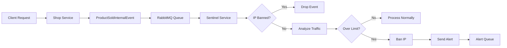

## Overview

Argos Mesh implements a comprehensive **DDoS protection strategy** that combines rate limiting, IP blocking, and real-time alerting to defend against distributed denial-of-service attacks. The Sentinel service acts as a security gateway, analyzing traffic patterns and automatically mitigating threats.

<Note>
The DDoS protection system runs on **Java 21 Virtual Threads**, enabling it to handle thousands of concurrent connections with minimal resource overhead.
</Note>

## Protection Architecture

The DDoS protection system consists of three integrated components:

<CardGroup cols={3}>

<Card title="TrafficAnalyzer" icon="chart-line">
Monitors request rates using a sliding window algorithm and identifies abusive traffic patterns.
</Card>

<Card title="RedisService" icon="database">
Manages a distributed IP blacklist with automatic expiration, shared across all service instances.
</Card>

<Card title="SalesListener" icon="ear-listen">
Processes events in real-time, coordinating traffic analysis and alert generation.
</Card>

</CardGroup>

## How DDoS Protection Works

### Event Flow

Here's the complete flow from an incoming request to threat mitigation:



<Steps>

### Step 1: Event Generation

When a product is sold, the Shop service publishes a `ProductSoldInternalEvent` to RabbitMQ:

```java
public record ProductSoldInternalEvent(
    Long productID,
    Integer quantity,
    String ipAddress,
    LocalDateTime timeStamp
) {}
```

**Source**: `sentinel/src/main/java/com/argos/sentinel/dto/ProductSoldInternalEvent.java`

### Step 2: Event Reception

The Sentinel service listens on the `argos.sales.queue` and receives events asynchronously:

```java
@RabbitListener(queues = "argos.sales.queue")
public void processSalesEvents(ProductSoldInternalEvent data) {
    String ip = data.ipAddress();

    if (redisService.isBanned(ip)) {
        return;
    }

    if (analyzer.processAndCheckLimit(ip)) {
        AlertInternalEvent event = new AlertInternalEvent(
            "Suspicious behavior", 
            ip, 
            "CRITICAL", 
            LocalDateTime.now()
        );            
        rabbitTemplate.convertAndSend(
            RabbitMQConfig.ALERT_EXCHANGE,
            "argos.alert.security",
            event
        );
    } else {
        System.out.println("[ Sentinel🛡️ ] Normal traffic of the IP: " + ip);
    }
}
```

**Source**: `sentinel/src/main/java/com/argos/sentinel/service/SalesListener.java:25-44`

### Step 3: Blacklist Check

Before analyzing traffic, check if the IP is already banned:

```java
if (redisService.isBanned(ip)) {
    return;  // Silently drop events from banned IPs
}
```

This prevents banned IPs from consuming resources or generating redundant alerts.

### Step 4: Traffic Analysis

The `TrafficAnalyzer` implements a sliding window rate limiter:

```java
public boolean processAndCheckLimit(String ip) {
    if (redisService.isBanned(ip)) return true;

    String key = RATE_PREFIX + ip;
    
    Long currentCount = redisTemplate.opsForValue().increment(key);

    if (currentCount != null && currentCount == 1) {
        redisTemplate.expire(key, Duration.ofSeconds(WINDOW_SECONDS));
    }

    if (currentCount != null && currentCount > LIMIT) {
        redisService.banIp(ip, 10);
        return true;
    }

    return false;
}
```

**Source**: `sentinel/src/main/java/com/argos/sentinel/service/TrafficAnalyzer.java:22-39`

**Parameters**:
- **LIMIT**: 50 requests
- **WINDOW_SECONDS**: 10 seconds
- **Ban Duration**: 10 minutes

### Step 5: Automatic Ban

When the threshold is exceeded, the IP is banned:

```java
public void banIp(String ipAddress, long durationMinutes) {
    redisTemplate.opsForValue().set(
        BLACKLIST_PREFIX + ipAddress,
        "BANNED",
        Duration.ofMinutes(durationMinutes)
    );
}
```

**Source**: `sentinel/src/main/java/com/argos/sentinel/service/RedisService.java:19-26`

### Step 6: Alert Generation

A critical security alert is sent to the alert queue:

```java
AlertInternalEvent event = new AlertInternalEvent(
    "Suspicious behavior",
    ip,
    "CRITICAL",
    LocalDateTime.now()
);

rabbitTemplate.convertAndSend(
    RabbitMQConfig.ALERT_EXCHANGE,
    "argos.alert.security",
    event
);
```

This alert can trigger notifications, logging, or automated responses in downstream services.

</Steps>

## Java 21 Virtual Threads

The Sentinel service leverages **Java 21 Virtual Threads** for high-concurrency request processing:

```properties
spring.threads.virtual.enabled=true
```

**Source**: `sentinel/src/main/resources/application.properties`

### Why Virtual Threads?

<CardGroup cols={2}>

<Card title="Massive Concurrency" icon="layer-group">
Handle thousands of concurrent requests without the overhead of traditional threads. Each request gets its own lightweight virtual thread.
</Card>

<Card title="Low Memory Footprint" icon="memory">
Virtual threads use ~1KB of memory vs ~1MB for platform threads, enabling massive scalability on limited hardware.
</Card>

<Card title="Simple Blocking Code" icon="code">
Write straightforward blocking I/O code without callbacks or reactive patterns. Virtual threads make blocking operations efficient.
</Card>

<Card title="DDoS Resilience" icon="shield-halved">
During an attack, thousands of malicious requests can be processed simultaneously without exhausting thread pools.
</Card>

</CardGroup>

<Info>
Virtual threads are automatically used by Spring Boot 3.2+ when RabbitMQ listeners process messages, making the Sentinel service highly resilient to traffic spikes.
</Info>

## Protection Scenarios

### Scenario 1: Scalping Bot Attack

**Attack Pattern**: A bot attempts to purchase all limited-edition products by making rapid requests.

<Steps>

### Bot Sends 100 Requests

A scalping bot sends 100 purchase requests in 3 seconds from IP `203.0.113.42`.

### Rate Limit Triggered

After request 51, the rate limit is exceeded:

```
Request 1-50:  ✅ Processed normally
Request 51:    ❌ LIMIT EXCEEDED → IP BANNED
Request 52-100: ❌ Dropped (IP blacklisted)
```

### IP Banned for 10 Minutes

Redis key created:
```
Key: blacklist:ip:203.0.113.42
Value: BANNED
TTL: 600 seconds
```

### Alert Generated

```json
{
  "type": "Suspicious behavior",
  "sourceIp": "203.0.113.42",
  "severity": "CRITICAL",
  "timeStamp": "2026-03-05T14:32:18"
}
```

### Bot Blocked

All subsequent requests from `203.0.113.42` are silently dropped for 10 minutes.

</Steps>

### Scenario 2: Distributed DDoS

**Attack Pattern**: A botnet of 1,000 infected devices sends traffic from different IPs.

<Steps>

### Attack Begins

1,000 bots each send 60 requests in 10 seconds (60,000 total requests).

### Individual Rate Limiting

Each bot's IP is analyzed independently:

```
Bot 1 (192.168.1.10):  Requests 1-50 ✅ | Request 51+ ❌ BANNED
Bot 2 (192.168.1.11):  Requests 1-50 ✅ | Request 51+ ❌ BANNED
Bot 3 (192.168.1.12):  Requests 1-50 ✅ | Request 51+ ❌ BANNED
...
Bot 1000 (192.168.1.1000): Requests 1-50 ✅ | Request 51+ ❌ BANNED
```

### Attack Mitigated

- **Processed**: 50,000 requests (50 per IP)
- **Blocked**: 10,000 requests (10 per IP)
- **Reduction**: 83% of attack traffic blocked

### Virtual Threads Handle Load

Despite 60,000 concurrent events, virtual threads prevent thread pool exhaustion:

```
Platform Threads: Would need 60,000 threads = 60GB RAM ❌
Virtual Threads:  60,000 virtual threads = 60MB RAM ✅
```

</Steps>

<Warning>
While the system handles individual IPs well, extremely large botnets (10,000+ IPs) may still cause resource exhaustion. Consider implementing upstream rate limiting at the load balancer level for comprehensive protection.
</Warning>

### Scenario 3: Legitimate Traffic Spike

**Pattern**: Your product goes viral on social media, causing a sudden surge in legitimate traffic.

<Steps>

### Surge Begins

10,000 unique users visit your site within 1 minute, each making 5-10 requests.

### Rate Limiting Allows Normal Use

Legitimate users stay well under the 50 requests/10 seconds limit:

```
User 1: 8 requests over 30 seconds   ✅ Not rate limited
User 2: 12 requests over 45 seconds  ✅ Not rate limited
User 3: 35 requests over 60 seconds  ✅ Not rate limited
```

### Virtual Threads Scale Seamlessly

The system processes 100,000 total requests without performance degradation:

```
Concurrent requests: 10,000
Virtual threads created: 10,000
Memory usage: ~10MB for threads
All requests processed successfully ✅
```

### No False Positives

Because legitimate users don't exceed 50 requests in 10 seconds, no IPs are banned.

</Steps>

## Configuration Recommendations

### Development Environment

```java
private static final int LIMIT = 100;           // Higher limit for testing
private static final int WINDOW_SECONDS = 10;
private static final int BAN_MINUTES = 5;       // Shorter ban duration
```

### Production Environment

```java
private static final int LIMIT = 50;            // Strict limit
private static final int WINDOW_SECONDS = 10;
private static final int BAN_MINUTES = 30;      // Longer ban for attackers
```

### High-Security Environment

```java
private static final int LIMIT = 20;            // Very strict
private static final int WINDOW_SECONDS = 10;
private static final int BAN_MINUTES = 60;      // 1-hour ban
```

<Info>
For e-commerce platforms during high-traffic events (Black Friday, product launches), consider temporarily raising the limit to prevent false positives.
</Info>

## Monitoring DDoS Protection

### Real-Time Metrics

Monitor these key metrics to assess DDoS protection effectiveness:

```bash
# Check current banned IPs
redis-cli KEYS "blacklist:ip:*" | wc -l

# Check active rate limit counters
redis-cli KEYS "rate:ip:*" | wc -l

# View recent alerts
redis-cli -h localhost -p 5672 # RabbitMQ Management UI
```

### Alert Queue Analysis

Query the alert queue to see DDoS activity:

```bash
# View messages in alert queue
rabbitmqadmin get queue=argos.alert.queue count=10
```

Example output:
```json
[
  {
    "type": "Suspicious behavior",
    "sourceIp": "203.0.113.42",
    "severity": "CRITICAL",
    "timeStamp": "2026-03-05T14:32:18"
  },
  {
    "type": "Suspicious behavior",
    "sourceIp": "198.51.100.78",
    "severity": "CRITICAL",
    "timeStamp": "2026-03-05T14:32:19"
  }
]
```

### Grafana Dashboard

Create a Grafana dashboard to visualize DDoS metrics:

<CardGroup cols={2}>

<Card title="Banned IPs Over Time" icon="chart-line">
Track the number of banned IPs to detect attack patterns.
</Card>

<Card title="Rate Limit Violations" icon="triangle-exclamation">
Graph the frequency of rate limit violations to identify attack intensity.
</Card>

<Card title="Alert Volume" icon="bell">
Monitor the number of security alerts generated per minute.
</Card>

<Card title="Request Processing Time" icon="clock">
Ensure virtual threads maintain low latency even under attack.
</Card>

</CardGroup>

## Defense Layers

Argos Mesh implements defense in depth:

<Steps>

### Layer 1: Network Edge

- **CDN/WAF**: CloudFlare, AWS Shield
- **Purpose**: Block known malicious IPs before they reach your infrastructure

### Layer 2: Load Balancer

- **Component**: NGINX, AWS ALB
- **Purpose**: Connection limiting, SSL termination, basic rate limiting

### Layer 3: Application (Sentinel Service)

- **Component**: TrafficAnalyzer + RedisService
- **Purpose**: Intelligent rate limiting, IP blocking, alerting
- **This is where Argos Mesh DDoS protection operates** ✅

### Layer 4: Database

- **Component**: Redis connection limits
- **Purpose**: Prevent resource exhaustion at the data layer

</Steps>

<Note>
Each layer provides protection, but the Sentinel service's application-layer defense is critical because it understands business logic and can make intelligent decisions about what constitutes abuse.
</Note>

## Best Practices

<CardGroup cols={2}>

<Card title="Deploy Multiple Sentinels" icon="clone">
Run multiple Sentinel service instances for high availability. They share Redis state automatically.
</Card>

<Card title="Use Redis Cluster" icon="database">
For large-scale deployments, use Redis Cluster to distribute blacklist and counter data.
</Card>

<Card title="Monitor Alert Queue" icon="bell">
Set up automated monitoring to notify security teams when alert volume spikes.
</Card>

<Card title="Implement Whitelisting" icon="shield-check">
Add IP whitelist logic to prevent false positives for internal services and monitoring systems.
</Card>

<Card title="Log All Bans" icon="file-lines">
Implement structured logging to track when and why IPs are banned for audit purposes.
</Card>

<Card title="Tune for Your Traffic" icon="sliders">
Adjust rate limits based on your application's normal traffic patterns. Monitor false positives.
</Card>

</CardGroup>

## Limitations

<Warning>
**IP Rotation**: Attackers using proxies or VPNs can rotate IPs to evade bans. Consider implementing additional signals like user-agent fingerprinting or CAPTCHA challenges.
</Warning>

<Warning>
**IPv6 Challenges**: IPv6 addresses can be easily rotated. Consider rate limiting by /64 subnet instead of individual addresses.
</Warning>

<Warning>
**Shared IPs**: Users behind corporate NAT or public WiFi share IPs. Aggressive rate limiting may cause false positives. Monitor and adjust accordingly.
</Warning>

## Extending Protection

### Add CAPTCHA for Suspicious Traffic

Instead of immediately banning, challenge suspicious IPs with CAPTCHA:

```java
if (currentCount > WARNING_THRESHOLD) {
    return Response.status(429)
        .entity(new CaptchaChallenge())
        .build();
}
```

### Implement Progressive Penalties

```java
if (currentCount > LIMIT) {
    int banDuration = calculateBanDuration(ip); // Longer bans for repeat offenders
    redisService.banIp(ip, banDuration);
}
```

### Add Machine Learning

Train a model to detect anomalous patterns:

```java
if (analyzer.processAndCheckLimit(ip) || mlModel.detectAnomaly(data)) {
    // Ban IP
}
```

## Related Resources

<CardGroup cols={2}>

<Card title="Rate Limiting" icon="gauge-high" href="/security/rate-limiting">
Detailed explanation of the sliding window algorithm
</Card>

<Card title="IP Blocking" icon="ban" href="/security/ip-blocking">
How to manually manage the IP blacklist
</Card>

<Card title="Architecture" icon="sitemap" href="/architecture">
Understand how Sentinel fits into the overall system
</Card>

<Card title="Event-Driven Design" icon="bolt" href="/api/events">
Learn about the RabbitMQ event flow
</Card>

</CardGroup>