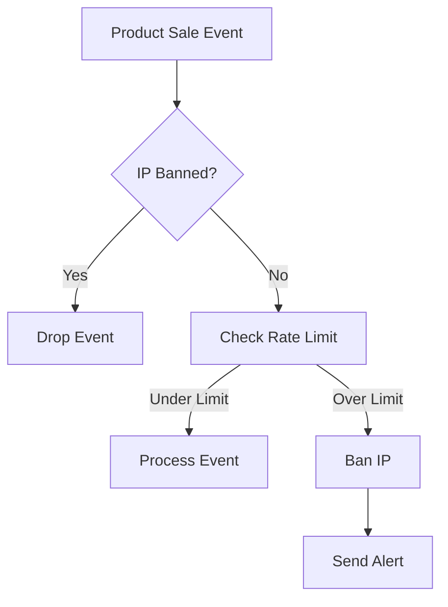

## Overview

The **IP Blocking** system in Argos Mesh provides a distributed blacklist managed by Redis. When suspicious activity is detected, IP addresses are automatically banned for a configurable duration to prevent further abuse.

<Info>
The IP blacklist is shared across all Sentinel service instances, ensuring consistent protection throughout your distributed system.
</Info>

## How IP Blocking Works

IP blocking is managed by the `RedisService` component, which provides two core operations:

1. **Ban an IP**: Add an IP to the blacklist with a TTL
2. **Check if banned**: Query whether an IP is currently blocked

### RedisService Implementation

Here's the complete implementation from the Sentinel service:

```java
@Service
public class RedisService {
    private final StringRedisTemplate redisTemplate;
    private static final String BLACKLIST_PREFIX = "blacklist:ip:";

    public RedisService(StringRedisTemplate redisTemplate) {
        this.redisTemplate = redisTemplate;
    }

    // Method that blocks an IP
    public void banIp(String ipAddress, long durationMinutes) {
        // Save the IP with the value "BANNED" and a TTL
        redisTemplate.opsForValue().set(
            BLACKLIST_PREFIX + ipAddress,
            "BANNED",
            Duration.ofMinutes(durationMinutes)
        );
    }

    public boolean isBanned(String ipAddress) {
        return Boolean.TRUE.equals(
            redisTemplate.hasKey(BLACKLIST_PREFIX + ipAddress)
        ); 
    }
}
```

**Source**: `sentinel/src/main/java/com/argos/sentinel/service/RedisService.java`

## Automatic Banning

### Trigger Conditions

IPs are automatically banned when they exceed the rate limit:

```java
if (currentCount != null && currentCount > LIMIT) {
    redisService.banIp(ip, 10);  // Ban for 10 minutes
    return true;
}
```

**Source**: `sentinel/src/main/java/com/argos/sentinel/service/TrafficAnalyzer.java:33-36`

<Steps>

### Step 1: Rate Limit Exceeded

When an IP makes more than 50 requests in a 10-second window, the threshold is breached.

### Step 2: Immediate Ban

The `banIp()` method is called with a 10-minute duration:

```java
redisService.banIp(ip, 10);
```

### Step 3: Redis Storage

A key is created in Redis:
- **Key**: `blacklist:ip:192.168.1.100`
- **Value**: `"BANNED"`
- **TTL**: 10 minutes (600 seconds)

### Step 4: Automatic Expiration

After 10 minutes, Redis automatically removes the key, unbanning the IP.

</Steps>

## Ban Duration

<Note>
The default ban duration is **10 minutes**. This provides a balance between security and user experience, preventing temporary network issues from causing permanent blocks.
</Note>

### Configuring Ban Duration

To modify the ban duration, update the `banIp()` call in `TrafficAnalyzer.java`:

```java
// Ban for 30 minutes instead of 10
redisService.banIp(ip, 30);
```

## Redis Key Structure

The blacklist uses a simple key-value pattern:

| Key Pattern | Example | Value | TTL |
|-------------|---------|-------|-----|
| `blacklist:ip:<address>` | `blacklist:ip:203.0.113.42` | `"BANNED"` | Duration (minutes) |

## Checking Ban Status

The `isBanned()` method is called at multiple checkpoints:

### 1. Before Rate Limiting

```java
public boolean processAndCheckLimit(String ip) {
    if (redisService.isBanned(ip)) return true;
    // ... rate limiting logic
}
```

**Source**: `TrafficAnalyzer.java:23`

### 2. Before Event Processing

```java
@RabbitListener(queues = "argos.sales.queue")
public void processSalesEvents(ProductSoldInternalEvent data) {
    String ip = data.ipAddress();

    if (redisService.isBanned(ip)) {
        return;  // Silently drop events from banned IPs
    }
    // ... continue processing
}
```

**Source**: `SalesListener.java:29-31`

<Warning>
Banned IPs have their events silently dropped. No alerts are generated for already-banned IPs to prevent alert spam.
</Warning>

## Manual IP Management

While Argos Mesh handles banning automatically, you can also manage the blacklist manually using Redis CLI.

### Manually Ban an IP

```bash
# Ban an IP for 1 hour (3600 seconds)
redis-cli SETEX "blacklist:ip:192.168.1.100" 3600 "BANNED"
```

### Manually Unban an IP

```bash
# Remove an IP from the blacklist immediately
redis-cli DEL "blacklist:ip:192.168.1.100"
```

### Check Ban Status

```bash
# Check if an IP is banned
redis-cli EXISTS "blacklist:ip:192.168.1.100"

# Returns:
# 1 = IP is banned
# 0 = IP is not banned
```

### View All Banned IPs

```bash
# List all currently banned IPs
redis-cli KEYS "blacklist:ip:*"

# Example output:
# 1) "blacklist:ip:192.168.1.100"
# 2) "blacklist:ip:203.0.113.42"
# 3) "blacklist:ip:198.51.100.78"
```

### Check Remaining Ban Time

```bash
# Get TTL (time-to-live) in seconds
redis-cli TTL "blacklist:ip:192.168.1.100"

# Example output:
# 456  (IP will be unbanned in 456 seconds)
# -1   (IP is banned permanently - no TTL set)
# -2   (IP is not banned - key doesn't exist)
```

## Integration Flow

Here's how IP blocking integrates with the complete security pipeline:



<Steps>

### Event Received

`ProductSoldInternalEvent` arrives from RabbitMQ with an IP address.

### First Check: Blacklist

```java
if (redisService.isBanned(ip)) {
    return;  // Stop processing immediately
}
```

### Second Check: Rate Limit

If not banned, analyze traffic patterns:

```java
if (analyzer.processAndCheckLimit(ip)) {
    // IP was just banned due to rate limit
    // Send alert
}
```

### Alert Generation

When a new ban occurs, send a critical alert:

```java
AlertInternalEvent event = new AlertInternalEvent(
    "Suspicious behavior", 
    ip, 
    "CRITICAL", 
    LocalDateTime.now()
);
```

</Steps>

## Performance & Scalability

<CardGroup cols={2}>

<Card title="O(1) Lookups" icon="gauge-high">
Redis `EXISTS` and `HASKEY` operations are constant time, providing instant ban checks.
</Card>

<Card title="Distributed State" icon="server">
All Sentinel instances share the same Redis blacklist, ensuring consistent protection.
</Card>

<Card title="Automatic Cleanup" icon="broom">
Redis TTL automatically removes expired bans without manual intervention.
</Card>

<Card title="Memory Efficient" icon="microchip">
Each banned IP uses only ~100 bytes of memory in Redis.
</Card>

</CardGroup>

## Use Cases

### Preventing Scalping Bots

<Info>
E-commerce bots often attempt to purchase limited inventory by making hundreds of requests per second. IP blocking stops these attacks after the first 50 requests.
</Info>

### DDoS Mitigation

During a distributed denial-of-service attack, each attacking IP is automatically identified and banned, reducing the attack surface.

### API Abuse Prevention

If a client misconfigures their application and sends excessive traffic, they're temporarily banned until the issue is resolved.

## Monitoring the Blacklist

Create a monitoring script to track banned IPs:

```bash
#!/bin/bash
# blacklist-monitor.sh

echo "=== Argos Sentinel Blacklist Monitor ==="
echo ""

BANNED_COUNT=$(redis-cli KEYS "blacklist:ip:*" | wc -l)
echo "Total banned IPs: $BANNED_COUNT"
echo ""

if [ $BANNED_COUNT -gt 0 ]; then
    echo "Currently banned IPs:"
    redis-cli KEYS "blacklist:ip:*" | while read key; do
        IP=$(echo $key | sed 's/blacklist:ip://')
        TTL=$(redis-cli TTL $key)
        echo "  - $IP (expires in ${TTL}s)"
    done
fi
```

## Best Practices

<CardGroup cols={2}>

<Card title="Monitor False Positives" icon="magnifying-glass-chart">
Regularly review banned IPs to ensure legitimate users aren't being blocked.
</Card>

<Card title="Whitelist Critical IPs" icon="shield-check">
Implement a whitelist for internal services and monitoring systems to prevent accidental bans.
</Card>

<Card title="Adjust Ban Duration" icon="clock">
For production systems, consider longer ban durations (30-60 minutes) for repeat offenders.
</Card>

<Card title="Log Ban Events" icon="file-lines">
Implement structured logging to track when and why IPs are banned for audit purposes.
</Card>

</CardGroup>

## Next Steps

<CardGroup cols={2}>

<Card title="Rate Limiting" icon="gauge-high" href="/security/rate-limiting">
Understand how rate limiting triggers automatic bans
</Card>

<Card title="DDoS Protection" icon="shield" href="/security/ddos-protection">
See how IP blocking fits into the complete security strategy
</Card>

</CardGroup>