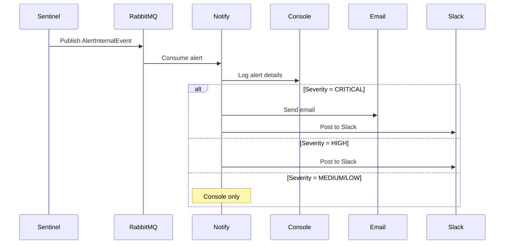

## Overview

The **Notify Service** is Argos Mesh's notification delivery system that consumes security alerts from the Sentinel service and delivers them to operators. It acts as the final stage in the security event pipeline, ensuring that critical alerts are properly logged and can be extended to support multiple notification channels.

<Info>
  Notify is designed as a lightweight, stateless service that focuses solely on alert delivery without external dependencies.
</Info>

## Architecture

### Service Responsibilities

<CardGroup cols={2}>
  <Card title="Alert Consumption" icon="download">
    Listens to the alert queue for security events from Sentinel
  </Card>
  <Card title="Notification Delivery" icon="paper-plane">
    Outputs alerts to configured notification channels (currently console)
  </Card>
  <Card title="Event Logging" icon="file-lines">
    Maintains a record of all security incidents
  </Card>
  <Card title="Extensibility" icon="plug">
    Designed to support email, SMS, Slack, and webhook integrations
  </Card>
</CardGroup>

## Core Components

### AlertNotifier

The `AlertNotifier` is the main component that processes incoming alerts:

```java
@Service
public class AlertNotifier {

    @RabbitListener(queues = "argos.alert.queue")
    public void sendNotification(AlertInternalEvent alert) {
        System.out.println("[ Alert ] - " + alert.timeStamp());
        System.out.println("The IP: " + alert.sourceIp());
        System.out.println("Is suspicious of try an: " + alert.type());
        System.out.println("This is: " + alert.severity());
    }
}
```

<Steps>
  <Step title="Event Reception">
    The `@RabbitListener` annotation subscribes to the `argos.alert.queue`
  </Step>
  
  <Step title="Deserialization">
    RabbitMQ automatically deserializes JSON messages to `AlertInternalEvent` objects
  </Step>
  
  <Step title="Notification Output">
    Alert details are formatted and output to the console (extensible to other channels)
  </Step>
</Steps>

## Event Schema

### AlertInternalEvent

The service consumes alert events from the Sentinel service:

```java
public record AlertInternalEvent(
    String type,        // "DDOs Attack" or "Suspicious behavior"
    String sourceIp,    // "127.0.0.1"
    String severity,    // "CRITICAL", "HIGH", "MEDIUM", "LOW"
    LocalDateTime timeStamp
) {}
```

**Field Descriptions:**

<Tabs>
  <Tab title="type">
    ### Alert Type
    
    Describes the nature of the security event:
    - `"Suspicious behavior"` - Rate limit exceeded
    - `"DDoS Attack"` - Distributed denial of service attempt
    - Extensible for future threat types
    
    ```java
    alert.type() // "Suspicious behavior"
    ```
  </Tab>
  
  <Tab title="sourceIp">
    ### Source IP Address
    
    The IP address that triggered the alert:
    
    ```java
    alert.sourceIp() // "192.168.1.100"
    ```
    
    <Note>
      This IP has been added to the Redis blacklist by the Sentinel service.
    </Note>
  </Tab>
  
  <Tab title="severity">
    ### Severity Level
    
    Indicates the priority of the alert:
    - `"CRITICAL"` - Immediate action required
    - `"HIGH"` - Urgent attention needed
    - `"MEDIUM"` - Monitor situation
    - `"LOW"` - Informational
    
    ```java
    alert.severity() // "CRITICAL"
    ```
  </Tab>
  
  <Tab title="timeStamp">
    ### Timestamp
    
    When the security event was detected:
    
    ```java
    alert.timeStamp() // 2026-03-05T14:23:45.123
    ```
    
    Uses `LocalDateTime` for timezone-independent recording.
  </Tab>
</Tabs>

## RabbitMQ Configuration

The service configures its messaging infrastructure:

```java
@Configuration
public class RabbitMQConfig {

    public static final String QUEUE_ALERT = "argos.alert.queue";
    public static final String ALERT_EXCHANGE = "alert.exchange";
    public static final String RK_ALERT = "argos.alert.#";

    @Bean
    public Queue alertQueue() {
        return new Queue(QUEUE_ALERT, true);
    }

    @Bean
    public TopicExchange exchange() {
        return new TopicExchange(ALERT_EXCHANGE);
    }

    @Bean
    public Binding binding(Queue alertQueue, TopicExchange exchange) {
        return BindingBuilder.bind(alertQueue).to(exchange).with(RK_ALERT);
    }
}
```

### Queue Configuration

<Card title="Alert Queue" icon="inbox">
  **Queue Name:** `argos.alert.queue`
  
  **Exchange:** `alert.exchange` (Topic)
  
  **Routing Key Pattern:** `argos.alert.#`
  
  **Durable:** `true` (survives broker restarts)
  
  The wildcard pattern `argos.alert.#` allows the service to receive all alert types:
  - `argos.alert.security`
  - `argos.alert.performance`
  - `argos.alert.*` (future extensions)
</Card>

### Message Converter

The service uses Jackson for JSON deserialization:

```java
@Bean
public ObjectMapper objectMapper() {
    ObjectMapper objectMapper = new ObjectMapper();
    objectMapper.registerModule(new JavaTimeModule());
    objectMapper.disable(SerializationFeature.WRITE_DATES_AS_TIMESTAMPS);
    return objectMapper;
}

@Bean
public MessageConverter jsonMessageConverter(ObjectMapper objectMapper) {
    return new Jackson2JsonMessageConverter(objectMapper);
}
```

<Info>
  The `JavaTimeModule` ensures proper serialization/deserialization of `LocalDateTime` fields.
</Info>

## Notification Output

When an alert is received, the service outputs structured information:

### Example Console Output

```
[ Alert ] - 2026-03-05T14:23:45.123
The IP: 192.168.1.100
Is suspicious of try an: Suspicious behavior
This is: CRITICAL
```

### Output Format

<Tabs>
  <Tab title="Standard Output">
    ```java
    System.out.println("[ Alert ] - " + alert.timeStamp());
    System.out.println("The IP: " + alert.sourceIp());
    System.out.println("Is suspicious of try an: " + alert.type());
    System.out.println("This is: " + alert.severity());
    ```
    
    The current implementation uses `System.out.println()` for simplicity, making alerts visible in container logs.
  </Tab>
  
  <Tab title="Container Logs">
    When running in Docker, these alerts appear in the container logs:
    
    ```bash
    docker logs argos-notify
    ```
    
    Or using Docker Compose:
    
    ```bash
    docker-compose logs -f notify
    ```
  </Tab>
  
  <Tab title="Production Logging">
    For production deployments, consider replacing `System.out` with a proper logging framework:
    
    ```java
    private static final Logger logger = LoggerFactory.getLogger(AlertNotifier.class);
    
    @RabbitListener(queues = "argos.alert.queue")
    public void sendNotification(AlertInternalEvent alert) {
        logger.error("[SECURITY ALERT] {} - IP: {}, Type: {}, Severity: {}",
            alert.timeStamp(),
            alert.sourceIp(),
            alert.type(),
            alert.severity()
        );
    }
    ```
  </Tab>
</Tabs>

## Extension Points

The Notify service is designed to be extended with multiple notification channels:

<CardGroup cols={2}>
  <Card title="Email Notifications" icon="envelope">
    Send alerts to on-call engineers via SMTP
    
    ```java
    @Service
    public class EmailNotifier {
        @Autowired
        private JavaMailSender mailSender;
        
        public void sendAlert(AlertInternalEvent alert) {
            // Email implementation
        }
    }
    ```
  </Card>
  
  <Card title="Slack Integration" icon="slack">
    Post alerts to Slack channels using webhooks
    
    ```java
    @Service
    public class SlackNotifier {
        @Value("${slack.webhook.url}")
        private String webhookUrl;
        
        public void sendAlert(AlertInternalEvent alert) {
            // Slack API call
        }
    }
    ```
  </Card>
  
  <Card title="SMS Alerts" icon="mobile">
    Send critical alerts via Twilio or AWS SNS
    
    ```java
    @Service
    public class SmsNotifier {
        @Autowired
        private TwilioClient twilioClient;
        
        public void sendAlert(AlertInternalEvent alert) {
            // SMS implementation
        }
    }
    ```
  </Card>
  
  <Card title="Webhook Integration" icon="webhook">
    POST alerts to external monitoring systems
    
    ```java
    @Service
    public class WebhookNotifier {
        @Autowired
        private RestTemplate restTemplate;
        
        public void sendAlert(AlertInternalEvent alert) {
            // HTTP POST to webhook
        }
    }
    ```
  </Card>
</CardGroup>

## Multi-Channel Notification Strategy

Implement a notification router based on severity:

```java
@Service
public class NotificationRouter {
    @Autowired
    private EmailNotifier emailNotifier;
    
    @Autowired
    private SlackNotifier slackNotifier;
    
    @Autowired
    private SmsNotifier smsNotifier;
    
    @RabbitListener(queues = "argos.alert.queue")
    public void routeAlert(AlertInternalEvent alert) {
        // Always log to console
        logToConsole(alert);
        
        // Route based on severity
        switch (alert.severity()) {
            case "CRITICAL":
                smsNotifier.sendAlert(alert);
                emailNotifier.sendAlert(alert);
                slackNotifier.sendAlert(alert);
                break;
            case "HIGH":
                emailNotifier.sendAlert(alert);
                slackNotifier.sendAlert(alert);
                break;
            case "MEDIUM":
                slackNotifier.sendAlert(alert);
                break;
            case "LOW":
                // Console logging only
                break;
        }
    }
}
```

<Note>
  This pattern allows you to escalate notifications based on severity, ensuring critical alerts reach multiple channels immediately.
</Note>

## Configuration

The service has minimal configuration requirements:

```properties
spring.application.name=argos-notify
```

### RabbitMQ Connection

RabbitMQ connection details are inherited from the default Spring Boot configuration:

```properties
# Add these if not using defaults
spring.rabbitmq.host=message_broker
spring.rabbitmq.port=5672
spring.rabbitmq.username=admin
spring.rabbitmq.password=admin123
```

## Deployment

<Steps>
  <Step title="No External Dependencies">
    The service only requires RabbitMQ - no database or cache needed
  </Step>
  
  <Step title="Stateless Design">
    Multiple instances can run concurrently for high availability
  </Step>
  
  <Step title="Lightweight Runtime">
    Minimal memory footprint suitable for constrained environments
  </Step>
  
  <Step title="Container-Ready">
    Logs to stdout/stderr for container log aggregation
  </Step>
</Steps>

## Traffic Flow



## Monitoring and Observability

Track notification delivery with Spring Boot Actuator:

```xml
<dependency>
    <groupId>org.springframework.boot</groupId>
    <artifactId>spring-boot-starter-actuator</artifactId>
</dependency>
```

### Metrics to Monitor

<CardGroup cols={2}>
  <Card title="Message Consumption Rate" icon="gauge">
    Track alerts processed per second
  </Card>
  <Card title="Queue Depth" icon="chart-line">
    Monitor `argos.alert.queue` backlog
  </Card>
  <Card title="Delivery Failures" icon="triangle-exclamation">
    Count failed notification attempts
  </Card>
  <Card title="Severity Distribution" icon="chart-pie">
    Analyze alert severity over time
  </Card>
</CardGroup>

## Error Handling

Implement retry logic for transient failures:

```java
@RabbitListener(queues = "argos.alert.queue")
public void sendNotification(AlertInternalEvent alert) {
    try {
        // Notification logic
    } catch (Exception e) {
        logger.error("Failed to deliver notification for alert: {}", alert, e);
        // Consider implementing dead-letter queue for failed alerts
        throw new AmqpRejectAndDontRequeueException("Notification delivery failed", e);
    }
}
```

<Info>
  Use `AmqpRejectAndDontRequeueException` to send failed messages to a dead-letter queue for manual investigation.
</Info>

## Next Steps

<CardGroup cols={2}>
  <Card title="Sentinel Service" icon="tower-observation" href="/services/sentinel">
    Learn how Sentinel generates security alerts
  </Card>
  <Card title="RabbitMQ Configuration" icon="message" href="/configuration/rabbitmq">
    Configure the message broker infrastructure
  </Card>
  <Card title="Security Features" icon="shield" href="/security/ddos-protection">
    Learn about the DDoS protection system
  </Card>
  <Card title="Deployment Guide" icon="rocket" href="/operations/docker-compose">
    Deploy the complete Argos Mesh stack
  </Card>
</CardGroup>