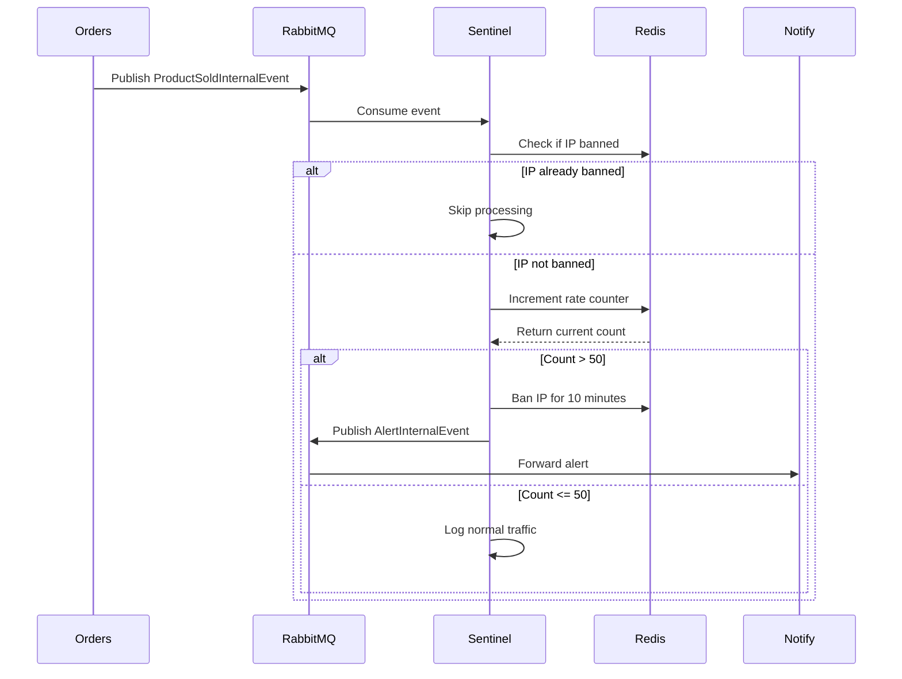

## Overview

The **Sentinel Service** is Argos Mesh's security monitoring microservice that provides real-time DDoS attack detection. It consumes sales events from the Orders service, analyzes traffic patterns using a sliding window rate limiting algorithm, and publishes alerts when suspicious behavior is detected.

<Info>
  Sentinel uses **Virtual Threads** (Project Loom) for high-throughput event processing and Redis for distributed state management.
</Info>

## Architecture

### Service Responsibilities

<CardGroup cols={2}>
  <Card title="Traffic Monitoring" icon="chart-line">
    Consumes sales events and tracks request rates per IP address
  </Card>
  <Card title="Rate Limiting" icon="gauge-high">
    Enforces 50 requests per 10-second window using Redis counters
  </Card>
  <Card title="Threat Detection" icon="shield-virus">
    Identifies DDoS attacks and suspicious traffic patterns
  </Card>
  <Card title="Alert Publishing" icon="bell">
    Publishes critical alerts to the Notify service
  </Card>
</CardGroup>

## Core Components

### SalesListener

The `SalesListener` is the entry point for all sales events from RabbitMQ:

```java
@Component
public class SalesListener {
    private final TrafficAnalyzer analyzer;
    private final RabbitTemplate rabbitTemplate;
    private final RedisService redisService;

    @RabbitListener(queues = "argos.sales.queue")
    public void processSalesEvents(ProductSoldInternalEvent data) {
        String ip = data.ipAddress();

        if (redisService.isBanned(ip)) {
            return; // Skip processing for already banned IPs
        }

        if (analyzer.processAndCheckLimit(ip)) {
            AlertInternalEvent event = new AlertInternalEvent(
                "Suspicious behavior", 
                ip, 
                "CRITICAL", 
                LocalDateTime.now()
            );            
            rabbitTemplate.convertAndSend(
                RabbitMQConfig.ALERT_EXCHANGE,
                "argos.alert.security",
                event
            );
        } else {
            System.out.println("[ Sentinel🛡️ ] Normal traffic of the IP: " + ip);
        }
    }
}
```

<Steps>
  <Step title="Event Reception">
    Listens to the `argos.sales.queue` for `ProductSoldInternalEvent` messages
  </Step>
  
  <Step title="Blacklist Check">
    Immediately returns if the IP is already banned (early exit optimization)
  </Step>
  
  <Step title="Traffic Analysis">
    Delegates to `TrafficAnalyzer` to check if the IP exceeds rate limits
  </Step>
  
  <Step title="Alert Generation">
    If suspicious behavior is detected, publishes an `AlertInternalEvent` with CRITICAL severity
  </Step>
</Steps>

### TrafficAnalyzer

The `TrafficAnalyzer` implements the rate limiting algorithm using Redis:

```java
@Component
public class TrafficAnalyzer {

    private final RedisService redisService;
    private final StringRedisTemplate redisTemplate;

    private static final int LIMIT = 50; 
    private static final int WINDOW_SECONDS = 10;
    private static final String RATE_PREFIX = "rate:ip:";

    public boolean processAndCheckLimit(String ip) {
        if (redisService.isBanned(ip)) return true;

        String key = RATE_PREFIX + ip;
        
        Long currentCount = redisTemplate.opsForValue().increment(key);

        if (currentCount != null && currentCount == 1) {
            redisTemplate.expire(key, Duration.ofSeconds(WINDOW_SECONDS));
        }

        if (currentCount != null && currentCount > LIMIT) {
            redisService.banIp(ip, 10);
            return true;
        }

        return false;
    }
}
```

## Rate Limiting Algorithm

Sentinel implements a **sliding window rate limiter** using Redis atomic operations:

<Tabs>
  <Tab title="Algorithm Overview">
    ### How It Works
    
    <Steps>
      <Step title="Increment Counter">
        For each request, increment the Redis counter for the IP:
        ```java
        Long currentCount = redisTemplate.opsForValue().increment("rate:ip:127.0.0.1");
        ```
      </Step>
      
      <Step title="Set Expiration">
        If this is the first request (count = 1), set a TTL of 10 seconds:
        ```java
        if (currentCount == 1) {
            redisTemplate.expire(key, Duration.ofSeconds(10));
        }
        ```
      </Step>
      
      <Step title="Check Threshold">
        If the count exceeds 50 requests, ban the IP:
        ```java
        if (currentCount > 50) {
            redisService.banIp(ip, 10); // Ban for 10 minutes
            return true; // Suspicious behavior detected
        }
        ```
      </Step>
    </Steps>
  </Tab>
  
  <Tab title="Configuration">
    ### Rate Limit Parameters
    
    ```java
    private static final int LIMIT = 50; 
    private static final int WINDOW_SECONDS = 10;
    ```
    
    <CardGroup cols={2}>
      <Card title="Request Limit" icon="hashtag">
        **50 requests** per time window
      </Card>
      <Card title="Time Window" icon="clock">
        **10 seconds** sliding window
      </Card>
    </CardGroup>
    
    <Note>
      This configuration allows burst traffic up to 50 requests, then automatically bans the IP for 10 minutes if exceeded.
    </Note>
  </Tab>
  
  <Tab title="Redis Keys">
    ### Key Structure
    
    **Rate Limiting Key:**
    ```
    rate:ip:<IP_ADDRESS>
    ```
    - **Value:** Integer counter
    - **TTL:** 10 seconds
    - **Purpose:** Tracks requests in the current window
    
    **Blacklist Key:**
    ```
    blacklist:ip:<IP_ADDRESS>
    ```
    - **Value:** "BANNED"
    - **TTL:** 10 minutes (600 seconds)
    - **Purpose:** Marks IPs banned for suspicious behavior
  </Tab>
</Tabs>

### RedisService

The `RedisService` manages IP blacklisting:

```java
@Service
public class RedisService {
    private final StringRedisTemplate redisTemplate;
    private static final String BLACKLIST_PREFIX = "blacklist:ip:";

    // Block an IP address for a specified duration
    public void banIp(String ipAddress, long durationMinutes) {
        redisTemplate.opsForValue().set(
            BLACKLIST_PREFIX + ipAddress,
            "BANNED",
            Duration.ofMinutes(durationMinutes)
        );
    }

    public boolean isBanned(String ipAddress) {
        return Boolean.TRUE.equals(
            redisTemplate.hasKey(BLACKLIST_PREFIX + ipAddress)
        ); 
    }
}
```

**Key Methods:**
- `banIp()`: Adds an IP to the blacklist with a TTL of 10 minutes
- `isBanned()`: Checks if an IP exists in the blacklist

<Info>
  The blacklist is shared across services - the Orders service also checks this Redis key before processing sales.
</Info>

## Event Schemas

### ProductSoldInternalEvent (Input)

Sentinel consumes sales events from the Orders service:

```java
public record ProductSoldInternalEvent(
    Long productID,
    Integer quantity,
    String ipAddress,
    LocalDateTime timeStamp
) {}
```

**Key Fields:**
- `ipAddress`: Used for rate limiting and DDoS detection
- `timeStamp`: Records when the sale occurred

### AlertInternalEvent (Output)

When suspicious behavior is detected, Sentinel publishes alerts:

```java
public record AlertInternalEvent(
    String type,        // "Suspicious behavior"
    String sourceIp,    // "127.0.0.1"
    String severity,    // "CRITICAL"
    LocalDateTime timeStamp
) {}
```

## RabbitMQ Configuration

Sentinel configures two sets of queues and exchanges:

### Input: Sales Queue

```java
public static final String QUEUE_SALE = "argos.sales.queue";    
public static final String EXCHANGE_SOLD = "shop.exchange";
public static final String RK_SALES = "shop.event.sold";
```

<Card title="Sales Event Consumption" icon="download">
  **Queue:** `argos.sales.queue`
  
  **Exchange:** `shop.exchange`
  
  **Routing Key:** `shop.event.sold`
  
  Receives sales events from the Orders service
</Card>

### Output: Alert Queue

```java
public static final String QUEUE_ALERT = "argos.alert.queue";
public static final String ALERT_EXCHANGE = "alert.exchange";
public static final String RK_ALERT = "argos.alert.#";
```

<Card title="Alert Publishing" icon="upload">
  **Queue:** `argos.alert.queue`
  
  **Exchange:** `alert.exchange`
  
  **Routing Key:** `argos.alert.security`
  
  Publishes alerts consumed by the Notify service
</Card>

## Virtual Threads Configuration

Sentinel leverages **Java 21 Virtual Threads** for high-throughput message processing:

```properties
spring.threads.virtual.enabled=true
spring.rabbitmq.listener.simple.prefetch=1
```

<Tabs>
  <Tab title="Virtual Threads">
    ### Why Virtual Threads?
    
    Virtual Threads (Project Loom) enable Sentinel to handle thousands of concurrent messages efficiently:
    
    - **Lightweight:** Each message is processed on a virtual thread with minimal memory overhead
    - **Scalable:** Can handle high-volume traffic without thread pool exhaustion
    - **Non-blocking:** Ideal for I/O-heavy operations like Redis lookups
    
    <Info>
      Virtual threads are automatically used by Spring Boot when `spring.threads.virtual.enabled=true` is set.
    </Info>
  </Tab>
  
  <Tab title="Prefetch Configuration">
    ### Prefetch Setting
    
    ```properties
    spring.rabbitmq.listener.simple.prefetch=1
    ```
    
    The prefetch count of 1 ensures:
    - **Fair distribution** of messages across multiple instances
    - **Backpressure handling** prevents overwhelming the service
    - **Sequential processing** per consumer for consistent rate limiting
  </Tab>
</Tabs>

## Traffic Flow



## Security Features

<CardGroup cols={2}>
  <Card title="DDoS Prevention" icon="shield">
    Automatically detects and blocks IPs exceeding 50 requests per 10 seconds
  </Card>
  
  <Card title="Distributed State" icon="database">
    Uses Redis for shared blacklist across multiple service instances
  </Card>
  
  <Card title="Automatic Unbanning" icon="clock-rotate-left">
    IPs are automatically unbanned after 10 minutes using Redis TTL
  </Card>
  
  <Card title="Real-time Alerts" icon="siren">
    Immediately notifies operators of critical security events
  </Card>
</CardGroup>

## Deployment Considerations

<Steps>
  <Step title="Redis Connection">
    Ensure Redis is accessible for distributed rate limiting
  </Step>
  
  <Step title="RabbitMQ Configuration">
    Configure connection to the message broker:
    ```properties
    spring.rabbitmq.host=message_broker
    spring.rabbitmq.port=5672
    spring.rabbitmq.username=admin
    spring.rabbitmq.password=admin123
    ```
  </Step>
  
  <Step title="Java 21 Runtime">
    Virtual threads require Java 21 or later
  </Step>
  
  <Step title="Horizontal Scaling">
    Multiple Sentinel instances can run concurrently, sharing Redis state
  </Step>
</Steps>

## Next Steps

<CardGroup cols={2}>
  <Card title="Orders Service" icon="shopping-cart" href="/services/orders">
    Learn about the service that generates sales events
  </Card>
  <Card title="Notify Service" icon="bell" href="/services/notify">
    See how alerts are delivered to operators
  </Card>
  <Card title="Redis Configuration" icon="database" href="/configuration/redis">
    Configure the Redis cache layer
  </Card>
  <Card title="Rate Limiting" icon="gauge" href="/security/rate-limiting">
    Deep dive into rate limiting strategies
  </Card>
</CardGroup>